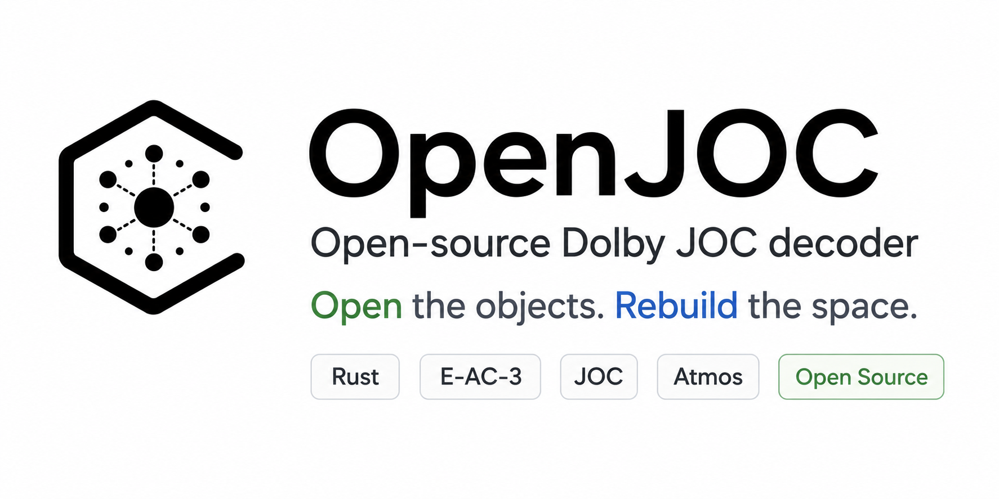

<p align="center">
  
</p>

# OpenJOC

OpenJOC is an independent, clean-room, research-grade E-AC-3 JOC metadata
and reconstruction-basis decoder. It implements behavior from public ETSI
specifications and controlled, permitted evidence; it does not copy Dolby
private implementations.

OpenJOC is not affiliated with, endorsed by, or sponsored by Dolby
Laboratories. Dolby, Dolby Atmos, and related marks are trademarks of their
respective owners.

The immutable v0.2.0 release contract is deliberately narrow:

- `scene.json` is metadata-only;
- `diagnostics/reconstruction_rows/row_NNN.wav` contains diagnostic
  `ReconstructionBasis` rows, not verified authored-object PCM;
- `SemanticBindingState` remains `Unresolved`;
- `ETSI_STRICT` was the historical no-profile default and is never silently
  downgraded;
- `OBSERVED_VENDOR_COMPAT` is explicit, partial, and preserves opaque observed
  continuation without assigning vendor semantics.

OpenJOC 0.5.0 is the current release line. It includes major
reconstruction-fidelity corrections, including corrected QMF synthesis
behavior and Base/ReconstructionBasis timeline alignment, plus an
experimental JOC-to-speaker workflow through `JocSpatialBridge`. Ordinary
rendering assembles bridge control from decoded JOC/OAMD state;
`--topology` remains an optional complete override/test input.

The selectable `5.1`, `5.1.2`, `5.1.4`, `7.1`, `7.1.2`, `7.1.4`, `7.1.6`,
`9.1`, `9.1.2`, `9.1.4`, and `9.1.6` workflows are documented in
[JOC speaker rendering](docs/JOC_RENDER.md). The same workflow can virtualize
all public virtual binaural layouts through a user-supplied strict SOFA HRIR
bank when directions are exact or safely interpolatable. The default virtual
layout is `7.1.4`; `7.1.6` and the `9.1` family provide semantic speaker-to-CAF
output independently and can also be used as dataset-dependent binaural
virtual fields.
The underlying public `SpatialLayout` plus `JocSpatialBridge` API remains a
generic N-channel library interface for caller-defined layouts; the CLI names
are convenience presets, not the renderer's fundamental maximum.

OpenJOC 0.3.0 was the local release candidate. It added an explicit
spatial-rendering foundation for caller-supplied mono sources: validated 2D and
3D speaker layouts, sample-accurate trajectories, direct-FIR and uniform
partitioned binaural rendering, and a strict supported SOFA import path. These
renderer workflows are independent of unresolved JOC authored-object binding.

User-facing `decode` and `decode-payload` commands default to observable `AUTO`
profile selection. `AUTO` tries `ETSI_STRICT` first and can select only the
existing whitelisted `OBSERVED_VENDOR_COMPAT` policy when every blocking
deviation is admitted. Explicit `ETSI_STRICT` never falls back.

The opt-in `JocSpatialBridge` provides the codec-coordinate spatial projection
function. Its current maturity is experimental, its semantic binding remains
unresolved, and its official runtime validation oracle is not independently
confirmed. These states are documented separately from the stable function
name.

Read the canonical documentation:

- [Capabilities](docs/CAPABILITIES.md) — current 0.5.0 capability status.
- [JOC speaker rendering](docs/JOC_RENDER.md) — the 0.5.0 real-input workflow.
- [Known limitations](docs/KNOWN_LIMITATIONS.md) — what remains out of scope.
- [Architecture](docs/ARCHITECTURE.md) — production data flow and boundaries.
- [Roadmap](docs/ROADMAP.md) — future priorities only.

## Build from source

OpenJOC requires Rust 1.85 or newer. The application dependency graph is
recorded in `Cargo.lock`.

```sh
cargo build -p openjoc-cli --release --locked
./target/release/openjoc --help
```

An offline build is supported when all locked registry dependencies are
already present in the selected Cargo cache:

```sh
cargo build -p openjoc-cli --release --locked --offline
```

This is not a claim that a brand-new machine can build without first obtaining
the Rust toolchain and dependencies. The repository declares a minimum Rust
version but does not pin one exact compiler release.

## Install into a prefix

From a clean source checkout or source archive:

```sh
cargo install --path crates/openjoc-cli --locked --root /path/to/prefix
/path/to/prefix/bin/openjoc --help
```

Binary distribution is handled by the human-created GitHub Release workflow
after a stable version tag. The historical [OpenJOC 0.2.0 release](https://github.com/chyinan/OpenJOC/releases/tag/v0.2.0)
contains the prior published assets; this source tree does not advertise a
Homebrew formula or crates.io installation. The source installation path
remains the workspace source tree.

## Basic CLI

```sh
openjoc inspect input.ec3
openjoc decode input.ec3 -o output/ --internal-base
openjoc decode input.mp4 -o output/ --internal-base --streaming
openjoc decode input.ec3 -o output/ --internal-base --validation-profile etsi-strict
openjoc render-joc input.m4a --layout 7.1.4 --output render.wav
openjoc render-joc input.m4a --layout 7.1.4 --output render.caf
openjoc render-joc input.m4a --layout 9.1.6 --output render-9.1.6.caf
openjoc render-joc input.m4a --binaural --sofa HRTF.sofa \
  --lfe-policy equal-power-dual-mono --output render-binaural.wav
openjoc render-joc input.m4a --binaural --sofa HRTF.sofa \
  --virtual-layout 9.1.6 --lfe-policy exclude --output render-binaural-9.1.6.wav
# Optional complete explicit override/test input:
openjoc render-joc input.m4a --topology bridge-control.json --layout 7.1.4 --output render.wav
openjoc diagnose-tools input.ec3 --vector-id ID --json tools.json
```

`render-joc` selects the output container from the destination extension:
`.wav` uses WAVEFORMATEXTENSIBLE where the semantic layout is exactly
representable, and `.caf` uses Core Audio Format channel-layout metadata. The
9.1 family is semantic-CAF-only: its Wide identities are not exactly
representable by standard WAVEFORMATEXTENSIBLE and WAV requests fail closed.
The renderer’s semantic channel order is independent of that container choice.

`decode` and `decode-payload` use `AUTO` when no profile is supplied: they
evaluate `ETSI_STRICT` first and select `OBSERVED_VENDOR_COMPAT` only when the
existing compatibility validator admits the complete deviation set. An
explicit `--validation-profile etsi-strict` never falls back. The selected
profile and reason are written to the bounded validation diagnostics.

Interactive `render-joc` progress is written to stderr and is automatically
disabled for non-TTY output; use `--no-progress` to opt out. Add
`--performance-report FILE.json` to capture versioned stage timings and
realtime diagnostics. Use `--overwrite` for authorized replacement of existing
render outputs in scripts or other non-interactive runs. See [Experimental JOC speaker rendering](docs/JOC_RENDER.md)
for the report schema, synthetic harness, and real-media qualification
boundary.

Raw EC3 parsing and internal-base decoding run in-process. Some seekable
MP4/M4A and compatible-base paths use `ffprobe` and/or `ffmpeg`; see the
[capability matrix](docs/CAPABILITIES.md) for the exact boundary.

## Assemble the 0.5.0 Apple-Silicon release bundle

On an Apple-silicon macOS host with Python 3.12+, Rust, and the locked Cargo
dependencies already cached, a clean committed tree can assemble the release
bundle locally before publication:

```sh
python3 scripts/build-local-release.py --output /path/to/empty/output
cd /path/to/empty/output
shasum -a 256 -c openjoc-0.5.0-aarch64-apple-darwin.SHA256SUMS
tar -xzf openjoc-0.5.0-aarch64-apple-darwin.tar.gz
cd openjoc-0.5.0-aarch64-apple-darwin
./verify.sh
```

The bundle includes the canonical `docs/` tree, uses `git archive HEAD`, builds
with the locked dependency set, and refuses tracked worktree/index changes.
It is not Developer-ID signed and is not notarized. The script derives the
artifact version from the workspace package metadata.

## CI and tagged releases

Pull requests and pushes to `master` run the public GitHub Actions CI matrix.
It checks the documented Rust 1.85 MSRV, Linux quality gates, and
platform-neutral builds/tests on Windows x64 and macOS arm64. CI results are
build/test evidence; a CI result alone does not admit a published binary
release for a platform.

Only a human-created stable tag can start release automation (the historical
`v0.1.0` tag is preserved). The workflow requires the tag to match the Cargo
package version exactly, then
builds and verifies macOS arm64, Windows x86_64, and GNU/Linux x86_64 release
archives. Per-platform manifests remain internal workflow artifacts. The
aggregation job recomputes archive hashes and publishes only the three binary
archives plus one unified `SHA256SUMS` file. The workflow never creates or
pushes tags, and refuses to overwrite an existing GitHub Release. Artifact
attestation is not currently enabled; aggregate SHA-256, per-platform manifest
checks, and the macOS bundle's `verify.sh` remain release verification surfaces.

## Platform scope

The 0.5.0 release workflow targets Apple-silicon macOS
(`aarch64-apple-darwin`), Windows x86_64 (`x86_64-pc-windows-msvc`), and
GNU/Linux x86_64 (`x86_64-unknown-linux-gnu`). The local bundle command and
the candidate in this worktree validate only the Apple-silicon macOS path;
Windows and Linux release results come from their native CI jobs and must not
be inferred from a macOS build. The macOS bundle is ad-hoc signed and is not
Developer-ID signed or notarized.

## Contributing and provenance

Before changing codec behavior, read [CONTRIBUTING.md](CONTRIBUTING.md) and the
release-facing capability and limitation documents. The project treats public
normative sources and behavioral clean-room specifications as separate claim
classes; neither is a claim of Dolby endorsement, certification, or
bit-identical Reference Player output.

## License

Licensed under [Apache-2.0](LICENSE). The source archive includes the complete
license text, and Cargo package metadata carries the SPDX license identifier.
